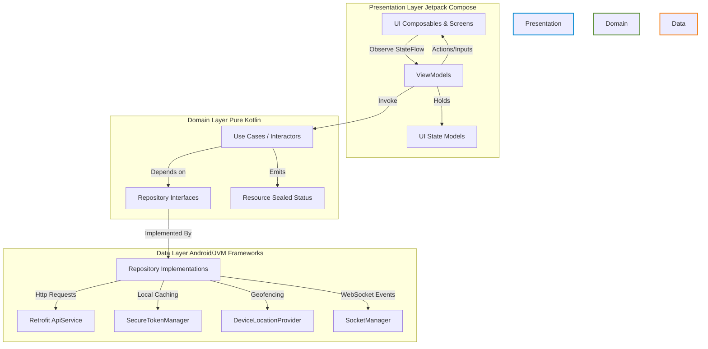
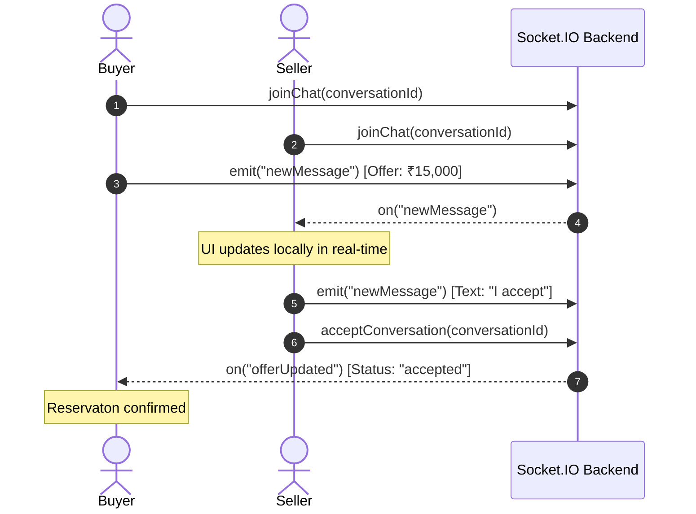

# 🛍️ VendorLink Android Client

[](https://kotlinlang.org/)
[](https://developer.android.com/jetpack/compose)
[](https://dagger.dev/hilt/)
[](https://developer.android.com)
[](https://developer.android.com)

VendorLink is a modern, high-performance Android e-commerce client built with **Jetpack Compose** and **Kotlin**. It enables seamless product discovery, secure checkout, real-time geographic filtering of listings, and direct buyer-to-seller price negotiations via custom real-time messaging offers.

---

## ✨ Features

- **🔐 Secure Authentication**: Integrated signup and login flows using industry-standard JWT credentials securely saved on-device via `EncryptedSharedPreferences`.
- **📍 Location-Based Cataloging**: Geo-queries listings using MongoDB `$geoNear` pipelines. The app automatically determines distances (in km) to nearby products.
- **💬 Real-time Price Negotiation**: Buyer-to-seller chat interface supported by a persistent Socket.IO room. Allows users to submit custom price offers that sellers can accept or reject instantly.
- **📦 Listing Management**: Acts as both a buying client and seller dashboard. Sellers can compose product drafts, fetch GPS coordinates using fused location APIs, upload media assets, and track pending sales.
- **🛒 Order Tracking**: Complete order lifecycle tracker showing status indicators (Placed, In-Transit, Completed) for both buyer purchases and seller orders.
- **🎨 Slate Design Theme**: Unified spacing rules and HSL colors optimized for both **Dark Mode** and **Light Mode** configurations.

---

## 🏗️ Architecture Blueprint

The project implements **Clean Architecture** patterns coupled with **MVVM (Model-View-ViewModel)** to achieve absolute separation of concerns, high testability, and clear dependency boundaries.



### Module Responsibilities

| Layer | Component | Package Path | Description |
| :--- | :--- | :--- | :--- |
| **Presentation** | Views | `presentation/screens/` | Declarative UI views built with Jetpack Compose. |
| | ViewModels | `presentation/viewmodel/` | Exposes state via `StateFlow` and handles UI events. |
| **Domain** | Use Cases | `domain/usecase/` | Encapsulates distinct, single-responsibility business logic actions. |
| | Abstractions | `domain/repository/` | Abstract repository contracts allowing Domain to remain decoupled from frameworks. |
| **Data** | Repositories | `data/repository/` | Combines local storage and remote HTTP endpoints into concrete data sources. |
| | Network | `data/remote/` / `data/network/` | Houses Retrofit interfaces, Socket.IO Managers, and authentication token interceptors. |
| | Cache | `data/local/` | Secure encrypted persistent storage logic. |
| **Core** | Common | `core/` | Global design parameters (Colors, Typography), base extensions, and dialogs. |

---

## 📂 Repository File Structure

```
app/src/main/java/com/arif/vl/
├── core/                         # Common UI Components and Theme Definitions
│   ├── components/               # Product Cards, Custom Chips, Top App Bars
│   ├── constants/                # AppConstants (Category lists, Order statuses)
│   ├── extensions/               # Navigation extensions for safe pop-backs
│   ├── theme/                    # Colors, Shapes, Spacing, Typography scales
│   └── utils/                    # Extensions (INR currency formatting), Dialogs
├── data/                         # Data layer handles APIs, Databases, and Providers
│   ├── local/                    # SecureTokenManager (Encrypted preferences)
│   ├── location/                 # DeviceLocationProvider (Fused GPS Client)
│   ├── model/                    # Serialization models (Gson adapter deserializers)
│   ├── network/                  # AuthInterceptor (OkHttp JWT injector)
│   ├── remote/                   # Retrofit API definitions and endpoint services
│   │   └── socket/               # SocketManager (WebSocket room bindings)
│   └── repository/               # Repository implementations (Auth, Products, Orders)
├── di/                           # Dagger-Hilt modules mapping bindings
│   ├── NetworkModule.kt          # Gson, OkHttp, Socket, and API Providers
│   └── RepositoryModule.kt       # Interface-to-Implementation bindings
├── domain/                       # Core business logic (Pure Kotlin)
│   ├── model/                    # Resource sealed classes for state propagation
│   ├── repository/               # Repository interfaces (Contracts)
│   └── usecase/                  # Interactors (Auth, Product, Order, Conversation)
├── navigation/                   # Compose router configuration
│   ├── NavRoutes.kt              # Centralized route strings
│   └── VLNavGraph.kt             # Navigation Host and graph construction
└── VLApplication.kt              # Hilt entry point with custom Coil memory caches
```

---

## ⚙️ Technical Highlights & Configurations

### 1. Security with Encrypted Preferences
Credentials and JWT tokens are saved using AES-256 GCM encryption via Jetpack Security. This prevents rooted devices or third-party backup tools from exposing access tokens:
```kotlin
val masterKey = MasterKey.Builder(context)
    .setKeyScheme(MasterKey.KeyScheme.AES256_GCM)
    .build()

val sharedPreferences = EncryptedSharedPreferences.create(
    context,
    "secure_prefs",
    masterKey,
    EncryptedSharedPreferences.PrefKeyEncryptionScheme.AES256_SIV,
    EncryptedSharedPreferences.PrefValueEncryptionScheme.AES256_GCM
)
```

### 2. Custom Coil Image Caching
To ensure zero scroll lag inside Compose lazy grids, image loading uses a custom instance of Coil configured with both a hardware memory cache and a persistent disk cache wrapper inside [VLApplication.kt](file:///e:/KotlinProjects/VL/app/src/main/java/com/arif/vl/VLApplication.kt):
- **Memory Cache**: Allocates up to 25% of active JVM heap RAM.
- **Disk Cache**: Allocates up to 150MB of internal storage space.
- **Network Policy**: Sets cross-fade animations and enables automatic cache policy lookups to bypass redundant requests.

### 3. Variant Logging Control
Timber acts as our log router. Logging is enabled only in debug variants to protect sensitive server logs in release environments:
```kotlin
if (BuildConfig.DEBUG) {
    Timber.plant(Timber.DebugTree())
}
```

---

## 💬 Real-Time Negotiation Workflow

The WebSocket integration in [SocketManager.kt](file:///e:/KotlinProjects/VL/app/src/main/java/com/arif/vl/data/remote/socket/SocketManager.kt) manages real-time bargaining flows. ViewModels connect to flows and map changes instantly:



---

## 🚀 Setup & Build Instructions

### Prerequisites
- **Android Studio**: Iguana (or newer)
- **Gradle Version**: 8.7
- **Target SDK**: 34

### Local Setup

1. **Clone project**
   ```bash
   git clone https://github.com/adiba-anwar01/vendorlink.git
   cd vendorlink
   ```

2. **Configure API Base URL**
   Open [app/build.gradle.kts](file:///e:/KotlinProjects/VL/app/build.gradle.kts) and adjust `BASE_URL` inside the `defaultConfig` block to point to your backend server IP:
   ```kotlin
   defaultConfig {
       // Local testing IP or production endpoint
       buildConfigField("String", "BASE_URL", "\"http://192.168.0.102:5000/api/\"")
       buildConfigField("long", "TOKEN_EXPIRY_SECONDS", "604800L")
       buildConfigField("int", "DEFAULT_SEARCH_RADIUS_METERS", "5000")
   }
   ```

3. **Build APK**
   Verify Hilt dependency injection mapping compiles successfully by running:
   ```bash
   ./gradlew assembleDebug --no-daemon
   ```

4. **Install on Device**
   Ensure an active Android emulator or physical device (USB debugging enabled) is attached:
   ```bash
   ./gradlew installDebug
   ```

---

## 📝 License

Distributed under the MIT License. See `LICENSE` for more information.
