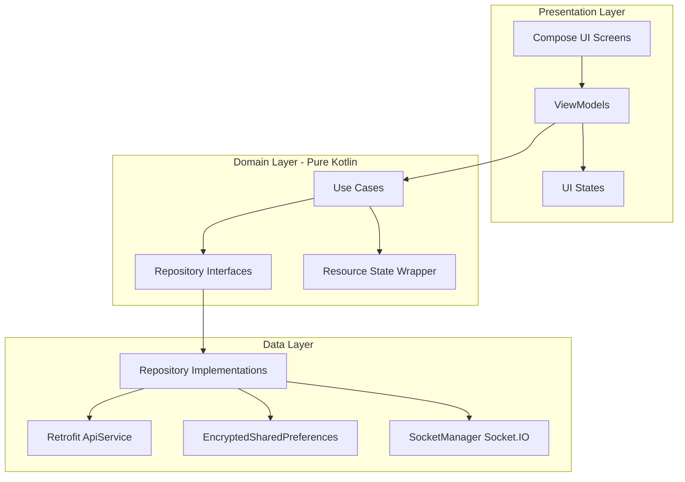

# VendorLink

[](https://kotlinlang.org)
[](https://developer.android.com)
[](https://developer.android.com/jetpack/compose)
[](https://dagger.dev/hilt/)
[](https://opensource.org/licenses/MIT)

VendorLink is a modern, high-performance Android e-commerce application built using Kotlin and Jetpack Compose. It empowers users to seamlessly browse products, place orders, securely negotiate prices via in-app chat, and manage listings.

---

## 🏗️ Architecture

The project is structured according to Clean Architecture principles following the **MVVM (Model-View-ViewModel)** architectural pattern. This layout promotes separation of concerns, testability, and scalability.



### Key Modules & Packages
- **`core/`**: Theme tokens (Color, Type, Shape, Spacing), reusable UI components, and common extensions/utilities.
- **`data/`**: Networking (Retrofit), database models, repository implementations, custom JSON deserializers, and local storage security configurations.
- **`domain/`**: Pure business logic containing use cases, domain model repository interfaces, and the generic state wrapper (`Resource`).
- **`di/`**: Hilt modules defining dependency injection graphs for network client configurations, interfaces, and secure storage bindings.
- **`presentation/`**: Screen layouts, ViewModels, and state representations grouped cleanly.

---

## 🛠️ Tech Stack & Libraries

- **UI Toolkit**: [Jetpack Compose](https://developer.android.com/jetpack/compose) for interactive declaratively built UIs.
- **Asynchronous / Stream Processing**: Kotlin Coroutines and Flows for non-blocking operations.
- **Dependency Injection**: [Dagger-Hilt](https://dagger.dev/hilt/) for constructor and field injection.
- **Networking**: [Retrofit](https://square.github.io/retrofit/) and OkHttp with logging interceptors.
- **Real-Time Communication**: Socket.IO client library for chat and instant price negotiations.
- **Image Loading**: [Coil](https://coil-kt.github.io/coil/) optimized with custom memory/disk caching algorithms for fluid scroll performance.
- **Local Storage Security**: Android Jetpack `EncryptedSharedPreferences` for securely persisting authentication tokens.
- **Logging**: [Timber](https://github.com/JakeWharton/timber) utility for automatic log filtering across build variants.

---

## 🚀 Setup & Installation

### Prerequisites
- Android Studio Iguana (or newer)
- Android SDK 28+

### Step-by-Step Configuration

1. **Clone the Repository**
   ```bash
   git clone https://github.com/yourusername/vendorlink.git
   cd vendorlink
   ```

2. **Configure the API Endpoint**
   The network base URL is externalized in `app/build.gradle.kts` via Hilt and `BuildConfig`.
   - By default, it points to local development IP: `http://192.168.0.101:5000/api/`
   - To target a custom local environment or production URL, change `BASE_URL` in `app/build.gradle.kts`:
     ```kotlin
     buildConfigField("String", "BASE_URL", "\"http://your-ip-address:5000/api/\"")
     ```

3. **Build the Application**
   Sync the Gradle dependencies and run:
   ```bash
   ./gradlew assembleDebug
   ```

---

## 📝 License

Distributed under the MIT License. See `LICENSE` for more information.

