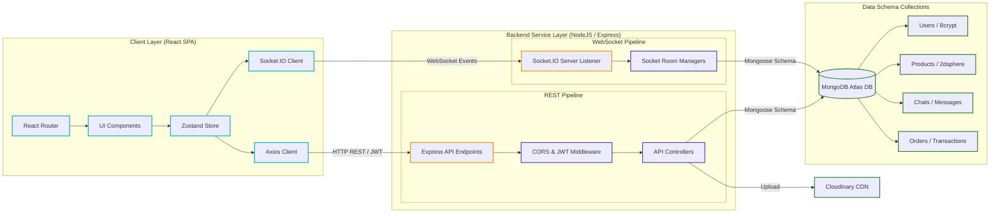
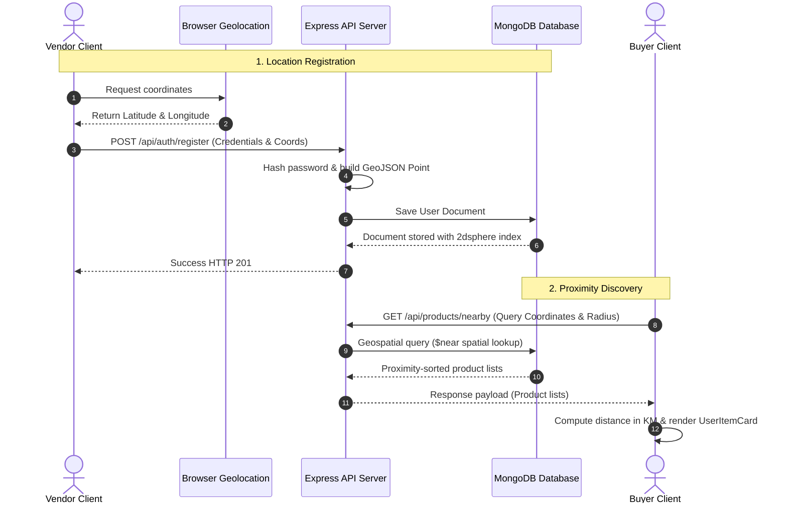
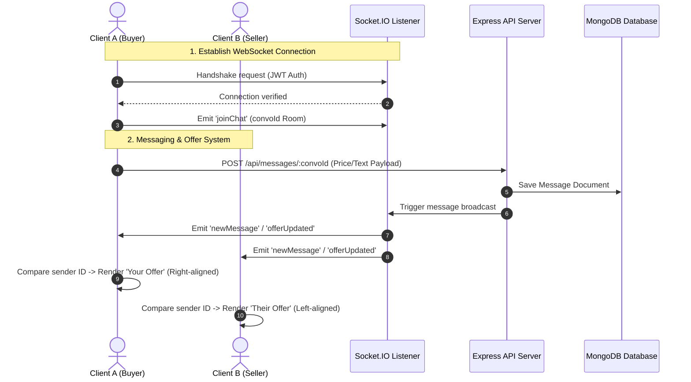
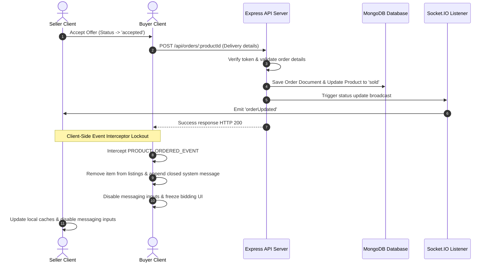

# VendorLink — Web Application

<p align="left">
  
  
  
  
  
  
  
  
</p>

**VendorLink** is a scalable full-stack **web application** built with the MERN stack that connects users and local vendors through a unified digital marketplace. The platform enables users to discover, buy, sell, and negotiate products while providing vendors with powerful tools to manage listings, orders, and business insights. It features geolocation-based product discovery, real-time messaging, interactive offer negotiation, end-to-end order lifecycle management, secure authentication, and an analytics-driven vendor dashboard. Designed with a modular, feature-based architecture and modern software engineering practices, VendorLink emphasizes scalability, maintainability, performance, and a seamless user experience.

## System Architecture

The application architecture is structured with a modular React frontend communicating with an Express and Socket.IO backend service. The diagram below outlines the structural layers and data transmission pipelines:



- **Client Layer**: Uses **React** and **Vite** for optimized builds. Global states are isolated inside **Zustand** stores, keeping components decoupled from direct API logic.
- **Communication Layer**: All REST queries are structured in JSON and secured with authorization tokens. Real-time features use persistent duplex TCP web sockets.
- **Backend Service Layer**: Express processes controllers, authorizes queries, manages file uploads, and relays images to Cloudinary CDN.
- **Data Layer**: Powered by **MongoDB** with geospatial indexing (`2dsphere`), storing documents mapped via **Mongoose ODM**.

---

## Tech Stack

- **Frontend Core**: React, Vite
- **State Management**: Zustand
- **Real-Time Layer**: Socket.IO Client
- **Styling & UI**: Tailwind CSS, Lucide React
- **Data Visualization**: Recharts
- **Backend Service**: Node.js, Express
- **Real-Time Server**: Socket.IO Server
- **Database Engine**: MongoDB Atlas
- **Media Hosting**: Cloudinary API

---

## Full-Stack Data & Control Flows

### 1. Geospatial Registration & Discovery Sequence

**Explanation of the Geospatial Pipeline:**
- **Registration Phase**: The vendor client initializes a registration request. The browser queries the HTML5 Geolocation API, returning the physical `[Latitude, Longitude]` coordinates. The frontend submits a POST registration payload. The Express server encrypts the password with Bcrypt and generates a Mongoose User schema format with a GeoJSON `Point` coordinate array. The document is persisted in MongoDB, which indexes the coordinates under a `2dsphere` type to support rapid location searches.
- **Discovery Phase**: A buyer sets a search radius. The client invokes a GET query with current coordinates and the search radius. The Express server executes a `$near` query in MongoDB. The database performs an index-based proximity search and returns the listings sorted from nearest to furthest. The client calculates the precise kilometer distances dynamically and renders the item cards.



---

### 2. Real-Time Chat & Price Negotiation Sequence

**Explanation of the Real-Time Bidding System:**
- **Socket Initialization**: When a user selects a thread, the client initializes the Socket.IO library, establishing a WebSocket connection using the active JWT for authorization. The client sends a `joinChat` message to bind their connection to the specific conversation ID room.
- **Negotiation Mechanics**: Sending text or a counter-offer invokes a REST POST API call. The backend writes the message to the database and instructs the socket server to emit a `newMessage` / `offerUpdated` message to all sockets connected to that room. The buyer and seller interfaces receive the payload instantly and compare the sender ID with their own ID. If it matches, it displays as `"Your Offer"` (right-aligned); if it differs, it displays as `"Their Offer"` (left-aligned).



---

### 3. Transaction Lockout & Fulfillment Sequence

**Explanation of the Lockout and Fulfillment Logic:**
- **Checkout Process**: The seller accepts the final price (updating thread state to `accepted`). The buyer initiates checkout, supplying address and billing details in the `OrderModal`, which submits a POST request to Express.
- **Order Creation & Lockout**: The backend generates an Order document in MongoDB and updates the corresponding Product status to `sold`. The Express backend emits an `orderUpdated` event via sockets.
- **Client Freeze Interceptor**: The buyer's browser intercepts `PRODUCT_ORDERED_EVENT` on the window. This updates the local Zustand caches, removing the sold item from the explore list. A closed-deal system notice is appended to the message thread, and all inputs, buttons, and textareas are disabled to lock the conversation.



---

## Technical Highlights & Configurations

### 1. Security & Cryptographic Safeguards
* **Encrypted Preferences & Secrets Protection**: Real secrets, including MongoDB URIs, JWT Signatures, and Cloudinary API credentials, are completely abstracted out of source code. A strict `.gitignore` setup ensures local `.env` files are never tracked or committed to version control.
* **Sensitive Hash Storage**: All user passwords are encrypted on the backend using **BcryptJS** with a work factor of 10 salt rounds before database persistence.
* **Axios Security Interceptors**: The client application implements centralized Axios interceptors that capture authenticated states and automatically append credentials to the request headers using the `Bearer` scheme.

### 2. State Synchronization & Performance
* **Persistent Stores**: Zustand handles user sessions and preferences with standard local storage synchronization middleware. This prevents layout reflows and keeps users authenticated upon page reloads.
* **Localized Client-Side Indexing**: Product catalog filters (Category, Status, Search, and Price Range) utilize `useMemo` hooks on the client. Database query results are fetched once on initial mount and filtered in-memory, avoiding redundant HTTP network calls and page-flickering renders.
* **Clean Socket Room Boundaries**: Client listeners disconnect when shifting away from message routes. This prevents background network congestion and keeps messaging threads isolated.

### 3. Modularity & Maintainability
* **Vite Path Aliasing**: Configured compiler path alias (`@/` -> `src/`) to eliminate nested relative imports (e.g., replacing `../../../utils/` with `@/utils/`), making imports highly readable.
* **Barrel Export Pattern**: Implemented clean barrel exports (`index.js`) for generic UI components (`Badge`, `Modal`, `InputWithIcon`, etc.) and Layout features, facilitating modular imports across features.
* **Feature Encapsulation**: Organized directory structures into separate domains (`auth`, `conversations`, `explore`, `orders`, `products`, `profile`, `dashboard`) so code grows horizontally without tight coupling.

---

## Repository Structure

The codebase follows enterprise design patterns:

### Frontend Structure (`frontend/`)
```
frontend/
├── public/                       # Static public assets
├── src/
│   ├── api/                      # Axios central instance & interceptors
│   ├── assets/                   # Local image and media assets
│   ├── components/               # Globally shared layouts & UI components
│   │   ├── layout/               # Layout shells (Dashboard, Navbar, Footer)
│   │   └── ui/                   # Reusable visual components (Badge, Modal, Inputs)
│   ├── constants/                # Project-wide static configurations & navigation maps
│   ├── features/                 # Modular, encapsulated domain features
│   │   ├── auth/                 # Sign-in, registration, and location detection
│   │   ├── conversations/        # Real-time chat list, chat pane, and message bubbles
│   │   ├── dashboard/            # Vendor statistics and graph visualization
│   │   ├── explore/              # Geolocation-aware search and map actions
│   │   ├── orders/               # Sales tracking & order fulfillment workflows
│   │   ├── products/             # Inventory creation, editing, and listing
│   │   └── profile/              # Store metadata and geolocation update panels
│   ├── services/                 # Socket client listeners & lifecycle hooks
│   ├── utils/                    # Shared helper libraries (price, dates, themes)
│   ├── App.jsx                   # Central routing registry
│   └── main.jsx                  # Virtual DOM mounter
├── .env.example                  # Frontend environment templates
├── .gitignore                    # Frontend version control filters
├── tailwind.config.js            # Tailwind layout and design tokens
├── vite.config.js                # Vite compiler & path alias settings
└── package.json                  # Client dependencies
```

### Backend Structure (`backend/`)
```
backend/
├── config/                       # DB connection configurations
├── controllers/                  # Request controllers & business logic
├── middleware/                   # Authentication & request interception
├── models/                       # Mongoose Database Schemas
├── routes/                       # Express router bindings
├── services/                     # Third-party utilities (e.g. Orders)
├── .env.example                  # Backend environment templates
├── server.js                     # Core entry point (HTTP & Socket.IO initialization)
└── package.json                  # Backend dependencies
```

---

## Setup & Running Guide

### Prerequisites
Ensure you have **Node.js** and **MongoDB** installed on your system.

### Step 1: Clone the Repository
Clone the repository and navigate into the root directory:
```bash
git clone https://github.com/adiba-anwar01/vendorlink.git
cd vendorlink
```

### Step 2: Install Dependencies
Navigate into each project directory and install the required dependencies:

```bash
# Install backend dependencies
cd backend
npm install

# Return to root and navigate to frontend
cd ../frontend
npm install
```

### Step 3: Environment Configuration
Create configuration files using the templates provided.

#### 1. Backend Service Configuration (`backend/.env`)
Copy the `backend/.env.example` file to `backend/.env` and replace placeholders with your credentials:
```env
PORT=5000
MONGODB_URI=your_mongodb_connection_string
JWT_SECRET=your_jwt_signing_secret_key_here

# Cloudinary Integration (Required for Product image uploads)
CLOUDINARY_NAME=your_cloudinary_cloud_name
CLOUDINARY_API_KEY=your_cloudinary_api_key
CLOUDINARY_API_SECRET=your_cloudinary_api_secret
```

#### 2. Frontend Configuration (`frontend/.env`)
Copy the `frontend/.env.example` file to `frontend/.env`:
```env
VITE_API_BASE_URL=http://localhost:5000/api
```

### Step 4: Run the Application
For local development, spin up both servers in parallel:

**Start Backend Server:**
```bash
cd backend
npm start
```
*The API server will listen on `http://localhost:5000`.*

**Start Frontend Dev Server:**
```bash
cd frontend
npm run dev
```
*The Vite application runs on `http://localhost:5173` and automatically opens in your default browser.*

---

## Production Build

To generate an optimized single-page static distribution package for production hosting:

```bash
cd frontend
npm run build
```
This produces an optimized `dist/` directory containing minified JS, CSS, and compressed images ready to be served by web servers or static hosts like Netlify, Vercel, or AWS S3.

---

## License

This project is licensed under the MIT License.
